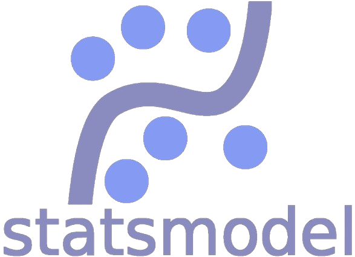

## Education 🎓

- **Master of Science in Applied and Computational Mathematics and Statistics**
  - University of Notre Dame, Notre Dame, IN
  - GPA: 3.54/4.00
  - Graduation: May 2023

- **Bachelor of Science in Applied and Computational Mathematics and Statistics**
  - University of Notre Dame, Notre Dame, IN
  - Minor in Actuarial Science
  - Graduation: May 2022

- **High School**
  - American School of Guatemala, Guatemala City, Guatemala
  - Student Body President, Athlete of the Year, National Honor Society
  - Graduation: May 2018

## Research 📚

- **Master's Research Project**
  - Title: Pricing European Options with Google AutoML, TensorFlow, and XGBoost
  - Date: Jan 2023 – July 2023
  - [Link to Paper](https://arxiv.org/abs/2307.00476)
  - [GitHub Repository](https://github.com/juan-esteban-berger/Options_Pricing_AutoML_TensorFlow_XGBoost)

## Technical Skills 🛠️

### Programming Languages
&nbsp;&nbsp;&nbsp;&nbsp;&nbsp;&nbsp;

### Machine Learning
&nbsp;&nbsp;&nbsp;&nbsp;&nbsp;&nbsp;&nbsp;&nbsp;&nbsp;&nbsp;

### Databases
&nbsp;&nbsp;&nbsp;

### Data Warehouses
&nbsp;&nbsp;&nbsp;

hello

### Data Processing
&nbsp;&nbsp;&nbsp;&nbsp;&nbsp;

### DevOps
&nbsp;&nbsp;
